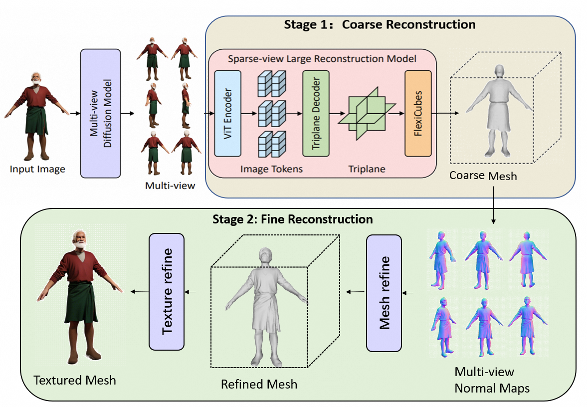
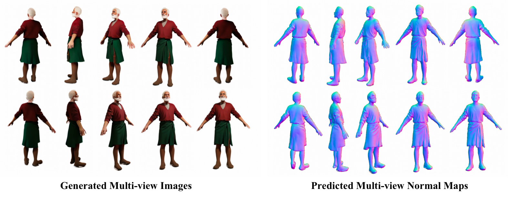
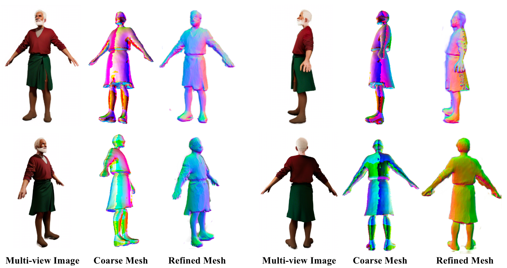

# AvatarMesh: 3D Avatar Mesh Generation from a Single Image

**AvatarMesh** is a framework for generating high-quality 3D human avatars from a single input image.  

<p align="center">
  
</p>

The pipeline consists of two main stages:

1. **Multi-view Image Generation**  
   
   From a single input image, we synthesize multiple novel views using a diffusion-based sparse-view generation model.  
   By focusing on clear geometry, this step provides strong priors for 3D reconstruction.
   
2. **3D Avatar Reconstruction**  
   The generated multi-view images are used to reconstruct the 3D geometry through a coarse-to-fine pipeline:  
   
   - **Coarse Reconstruction**: A large sparse-view transformer-based reconstruction model with SDF representation builds the initial coarse mesh.
   - **Refinement**: Using **SMPL model priors** and multi-view **normal maps**, the coarse mesh is refined to achieve accurate geometry and rich details.


---

## Installation

We recommend **Python >= 3.10**, **PyTorch >= 2.1.0**, and **CUDA >= 12.1**.

```bash
conda create --name avatarmesh python=3.10
conda activate avatarmesh
pip install -U pip

# Install ninja
conda install ninja

# Install CUDA (adjust version if needed)
conda install cuda -c nvidia/label/cuda-12.1.0

# Install PyTorch and xformers
pip install torch==2.1.0 torchvision==0.16.0 torchaudio==2.1.0 --index-url https://download.pytorch.org/whl/cu121
pip install xformers==0.0.22.post7

# Install other requirements
pip install -r requirements.txt
```

## Usage

### 1. Multi-view Image Generation

We adopt **SV3D** ([repo](https://github.com/Stability-AI/generative-models)) to generate **21 novel views** from a single input image.

```
# Download pretrained weights
wget https://huggingface.co/stabilityai/sv3d/resolve/main/sv3d_u.safetensors -P checkpoints/

# Run SV3D-u
python scripts/sampling/simple_video_sample.py \
    --input_path path/to/image.png \
    --version sv3d_u
```

### 2. Coarse Mesh Reconstruction

Generate a coarse 3D mesh from the 21 synthesized views:

```
python run.py configs/instant-mesh-large.yaml /path/to/img_dir/ --save_video
```

### 3. Normal Map Generation

Generate normal maps for the same views:

```
# Edit paths in command/infer.sh before running
bash command/image2normal.sh
```

The results (mesh, images, video) will be saved in `{$out_dir}`.

### 4. Mesh Refinement

Refine the coarse mesh using SMPL priors and normal maps:

```
python mesh_refine.py
```

------

## Results

### Multi-view Image and Normal Map Generation
From a single input image, our method generates multiple novel views and their corresponding normal maps:

<p align="center">
  
</p>


### Coarse-to-Fine 3D Reconstruction
Based on the generated multi-view images and normal maps, we reconstruct a coarse mesh and further refine it with SMPL priors:

<p align="center">
  
</p>


------

## Acknowledgements

We thank the authors of the following projects for their excellent contributions:

- [SV3D](https://github.com/Stability-AI/generative-models)
- [OpenLRM](https://github.com/3DTopia/OpenLRM)
- [InstantMesh](https://github.com/TencentARC/InstantMesh)
- [HiLo](https://github.com/YifYang993/HiLo)
